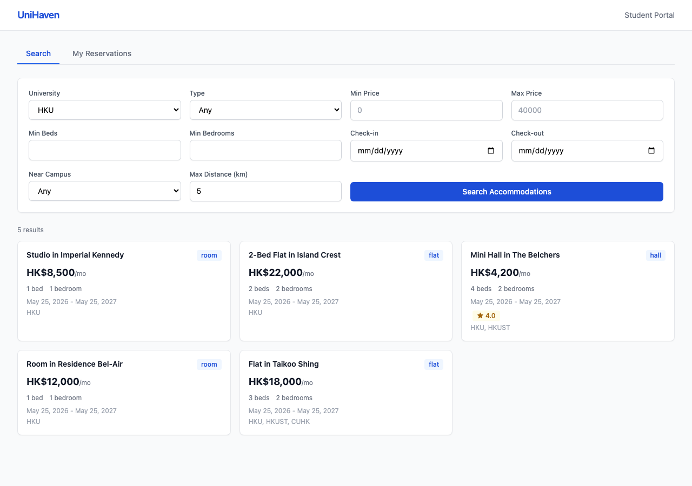
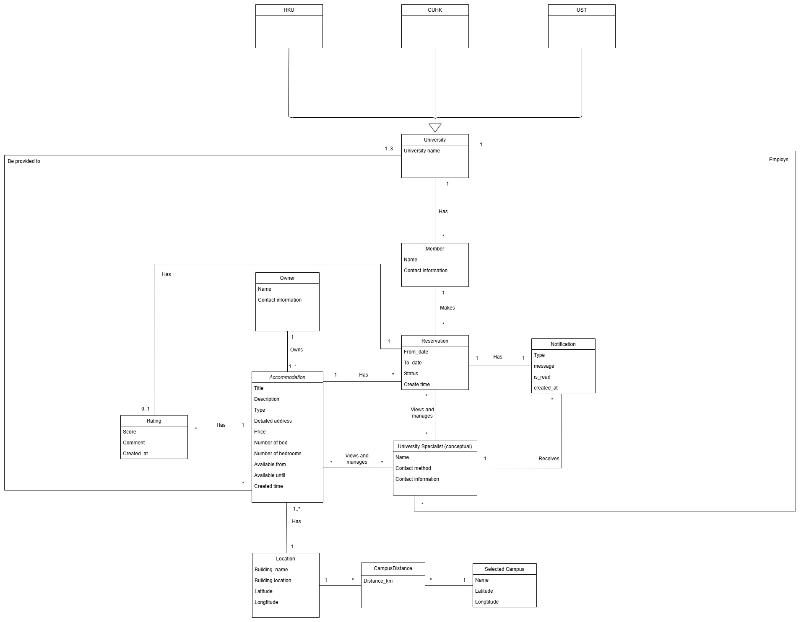
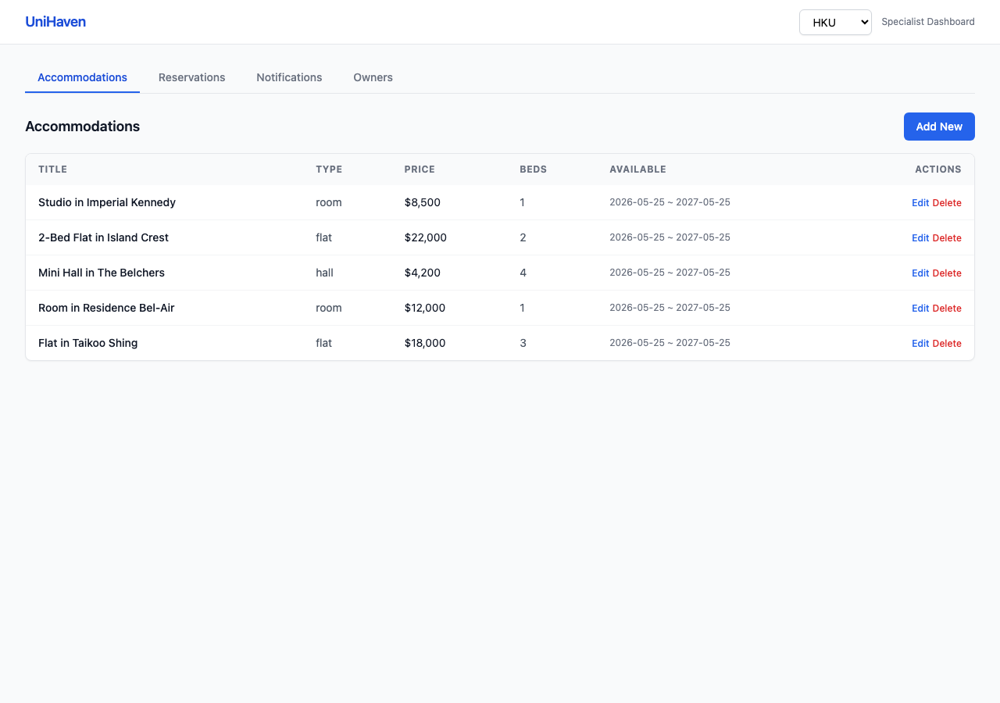
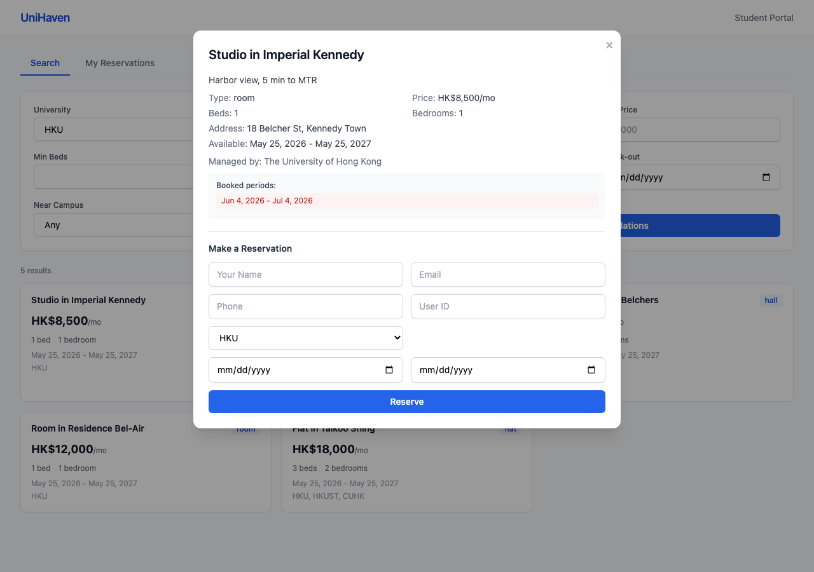
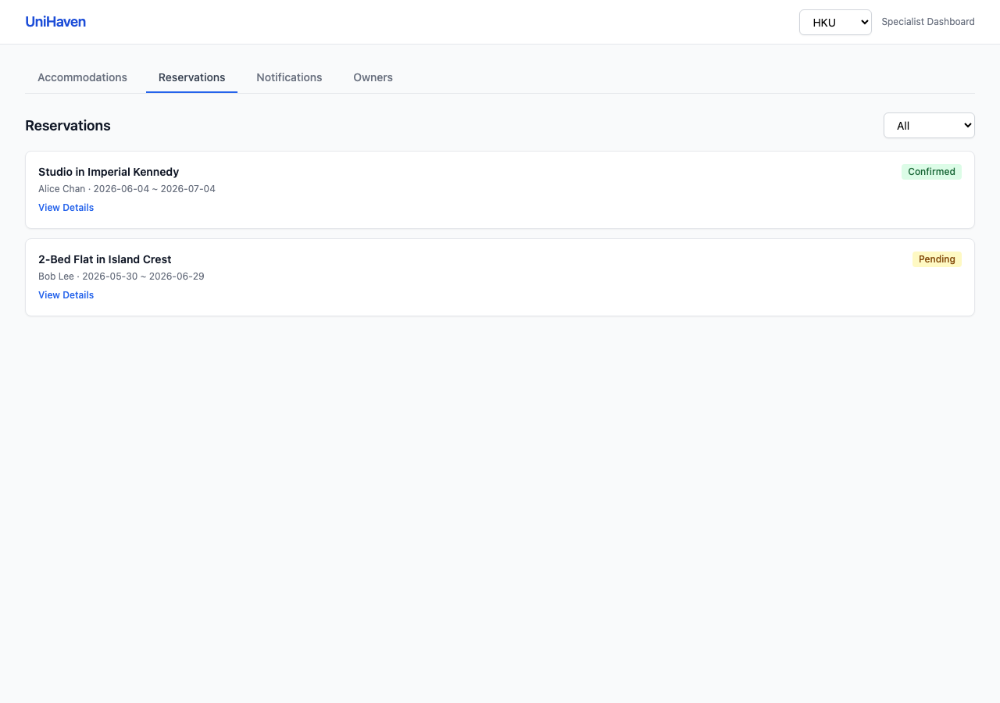
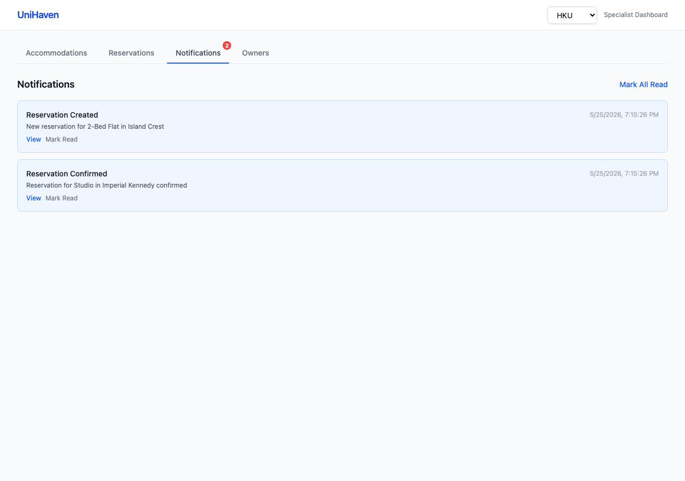
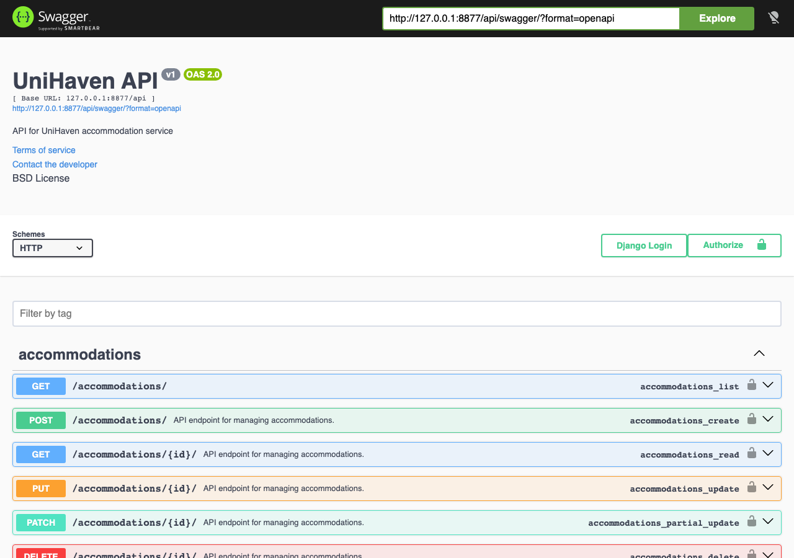

# UniHaven

Multi-university off-campus accommodation platform with geospatial search, reservation management, and real-time notifications. Built with Django REST Framework for the CEDARS housing offices at HKU, HKUST, and CUHK.

`Django` `DRF` `OpenAPI` `SQLite` `Tailwind CSS`

<p align="center">
  
</p>

## What it does

Students search for off-campus housing near their campus, filter by price/type/distance/dates, book accommodations, and rate them after checkout. Housing specialists manage listings, confirm or cancel reservations, and receive notifications, all scoped to their own university.

Two separate web portals hit the same REST API.

## Architecture

```
Student Portal ──┐                    ┌── DATA.GOV.HK
                 ├── DRF ViewSets ────┤   Address Lookup API
Specialist UI ───┘    (REST API)      └── Email (SMTP)
                         │
              ┌──────────┼──────────┐
              │          │          │
           Models    Serializers  Filters
              │
           SQLite
```

Three-layer design: Models define the schema, Serializers handle validation and nested representation, ViewSets expose filtered querysets with custom actions (confirm, cancel, complete, rate).

Each university sees only its own accommodations, reservations, and notifications. Achieved through a `universities` M2M field on Accommodation and a `university` FK on Reservation/Notification, with query parameter filtering in each ViewSet.

<p align="center">
  
</p>

## Screenshots

| Student Portal | Specialist Dashboard |
|:-:|:-:|
|  |  |
|  |  |

<details>
<summary>More screenshots</summary>

| Notifications | Swagger API |
|:-:|:-:|
|  |  |

</details>

## API

7 resource endpoints, all following REST conventions. Full OpenAPI 3.0 schema in `API_schema.yaml`.

| Endpoint | Methods | Description |
|----------|---------|-------------|
| `/api/accommodations/` | GET, POST, PUT, DELETE | Listings with distance filtering, university scoping |
| `/api/reservations/` | GET, POST, PUT, DELETE | Booking with overlap prevention, status lifecycle |
| `/api/reservations/{id}/confirm/` | POST | Specialist confirms a pending booking |
| `/api/reservations/{id}/cancel/` | POST | Cancel with email notification |
| `/api/reservations/{id}/complete/` | POST | Mark as completed, triggers rating eligibility |
| `/api/ratings/` | GET, POST | Post-checkout ratings, one per user per accommodation |
| `/api/notifications/` | GET, POST | University-scoped, mark-as-read support |
| `/api/locations/lookup_address/` | POST | Geocode via DATA.GOV.HK Address Lookup Service |
| `/api/universities/` | GET, POST, PUT, DELETE | University CRUD |
| `/api/owners/` | GET, POST, PUT, DELETE | Property owner management |

Interactive docs at `/api/swagger/` and `/api/redoc/`.
